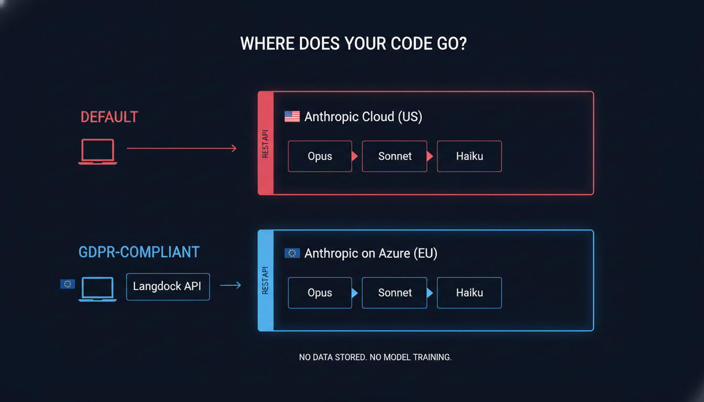
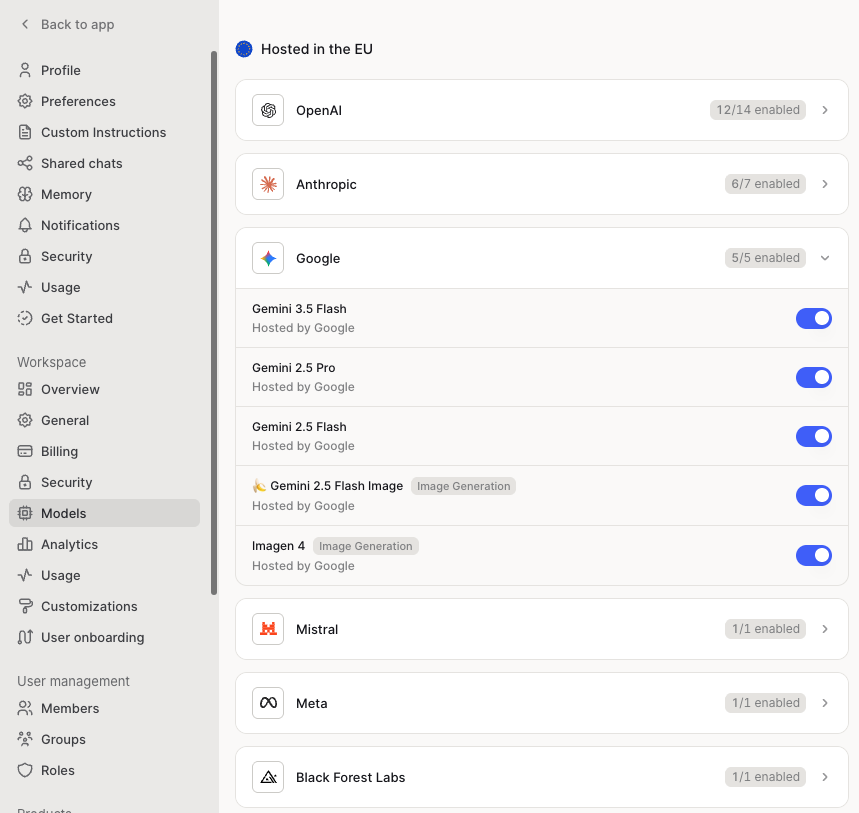
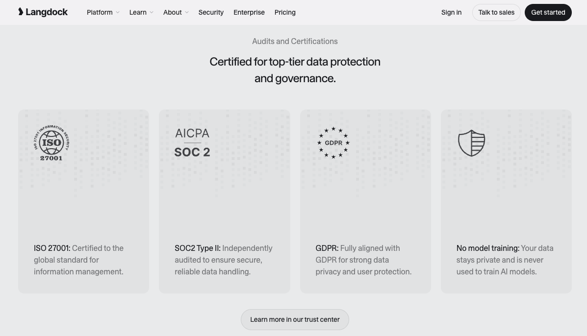
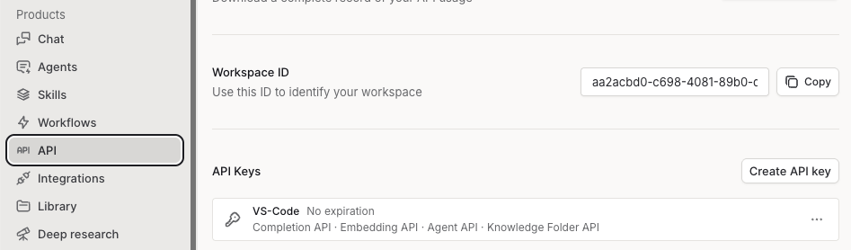

# Run Claude Code GDPR-Compliant — Through an EU Gateway

*Same tool, same workflow — but your data stays in the EU. Three environment variables, on Windows and Mac.*

For a lot of European Oracle teams, AI-assisted development stalls on one sentence: *"the data can't leave the EU."* This episode removes that blocker. We run the exact same Claude Code from [Episode 1](https://oracleai.substack.com/p/how-to-set-up-vs-code-claude-code), but route every request through an EU-hosted, GDPR-aligned gateway — so nothing leaves Europe and your compliance team gets a documented data path. Langdock is the example here, but the technique works for **any** Anthropic-compatible EU provider.

After reading this, you'll be able to point Claude Code at an EU gateway on both Windows and macOS — and even let Claude Code configure itself.



---

## Requirements

- A **Langdock account with API access** (to obtain a Langdock API key) — EU endpoint
- **Claude Code**, installed *either* as:
  - the Claude Code CLI (via `winget` on Windows / standard installer on macOS), **or**
  - VS Code with the Claude Code extension
- **Windows 11** (with `winget`) or **macOS**
- **Git Bash / a POSIX shell** (Windows only — carried over from Episode 1's baseline)
- **Network access to `api.langdock.com` on port 443** (corporate firewalls/proxies may block it)

---

## What I Wanted to Test

Here's the question I get from almost every Oracle shop I talk to in Europe: *"We'd love to use Claude Code, but can we? Where does our code go? Does it leave the EU?"*

For a lot of enterprises — especially anyone touching personal data in their Oracle systems — that's not a nice-to-have question. It's a hard gate. Legal says no EU data leaves the EU, and that's the end of the conversation. So the AI experiment never even starts.

So this is what I wanted to test: can I run Claude Code — the exact same tool, same workflow as Episode 1 — but route every request through an **EU-hosted gateway**, so the data stays in Europe and the whole thing lines up with GDPR? And can I do it on both Windows and macOS, without changing how I actually work day to day?

The answer is yes — and it comes down to three environment variables.

---

## Background: What Is Langdock? (And Why It's Only One Option)

Quick background, because most people outside Europe haven't heard of it.

Langdock is a European AI platform — based in Germany — built for companies that need to use AI but operate under EU data-protection rules. Think of it as a **gateway** that sits between you and the large language models. Instead of your requests going straight to a US endpoint, they go to Langdock's EU infrastructure first.

A few things that matter for our purposes:

- **EU data residency.** Processing happens in the EU. For Claude specifically, Langdock exposes an Anthropic-compatible endpoint hosted in Europe.
- **GDPR-aligned.** They offer Data Processing Agreements, they don't train models on your data, and they document their subprocessors and security posture.
- **Model-agnostic.** They front several model providers behind one API — not just Claude, but also GPT-4, Gemini, Mistral, and others, all hosted in the EU. We only care about the Claude side today, but the breadth matters if your organization wants to evaluate or consolidate multiple models under one GDPR-compliant roof.



If you're the person who has to take this to security or legal, the one link to send them is their security page:

**→ https://langdock.com/security**

That page covers certifications, hosting, data handling, and the subprocessor list — exactly the evidence a compliance review asks for.




### But Langdock is just *one* option

Here's the real point of this episode. **Langdock is an example, not a recommendation.** There's a whole landscape of European and privacy-focused AI providers, and the right one depends on your organization's requirements. A couple of starting points for finding alternatives:

- **https://mega.fragroger.ai/** — a curated overview of AI tooling options
- **https://european-alternatives.eu/** — a directory of EU-based / EU-hosted alternatives to common cloud services

So the question this episode actually answers isn't *"should you use Langdock?"* It's: **whatever EU-compliant, Anthropic-compatible provider you pick — how do you point Claude Code at it?**

The good news: because these gateways speak the **same API dialect as Anthropic**, the setup is identical no matter which one you choose. Claude Code thinks it's talking to Anthropic — it's actually talking to your chosen EU endpoint.

**One option worth calling out separately: your own Azure-hosted Claude instance.** Microsoft Azure offers Claude models through Azure AI — you provision your own endpoint, your data stays in whichever Azure region you choose (including EU regions), and you own the whole setup. For a larger organization that's already deep in the Azure ecosystem, this is often the right long-term answer: more control, cleaner integration with existing governance, and no third-party sitting between you and the model. The tradeoff is that it takes real setup time — Azure subscriptions, resource provisioning, IAM, the works.

**Langdock (and gateways like it) exist for a different moment: getting started.** If you want to evaluate whether Claude Code actually works for your team — before committing to Azure infrastructure — a gateway account is the fastest path. Sign up, generate an API key, set three environment variables, and you're testing in an afternoon. Once you've validated the workflow and made the business case, migrating to Azure is straightforward: you change one URL.

> **Field note:** I'm not affiliated with any of these. Langdock just happens to be a clean, working example. The exact same technique applies to any Anthropic-compatible gateway.

---

## The Setup — Three Environment Variables

Here's the whole trick. Claude Code decides where to send its requests based on a handful of environment variables. Override them, and you redirect it — no code changes, no special build, nothing patched.

There are exactly three that matter:

```shell
# Where Claude Code sends requests — your EU gateway, not the default US endpoint
ANTHROPIC_BASE_URL="https://api.langdock.com/anthropic/eu"

# Your gateway API key (NOT an Anthropic key — this is issued by your provider)
ANTHROPIC_AUTH_TOKEN="your-langdock-key"

# The model name, as your gateway names it
ANTHROPIC_MODEL="claude-sonnet-4-6-default"
```

Three things to understand before you touch a keyboard:

1. **`ANTHROPIC_BASE_URL`** is the redirect. This one value is what keeps your data in the EU. Swap in a different provider's URL here and everything else stays the same — that's the whole point from the last section.
2. **`ANTHROPIC_AUTH_TOKEN`** is *your gateway's* key, which you generate in the Langdock (or alternative) dashboard. It is **not** an `sk-ant-…` Anthropic key. Different system, different key. You can create one under `Account Settings > API` [https://app.langdock.com/settings/workspace/products/api](https://app.langdock.com/settings/workspace/products/api)

3. **`ANTHROPIC_MODEL`** has to match how the gateway names its models. Langdock uses names like `claude-sonnet-4-6-default`. If you get the model name wrong, this is the #1 cause of a failed first request — so check your provider's model list.

That's the entire concept. The rest is just *where* you put these three variables on Windows versus macOS — and a couple of gotchas that'll save you twenty minutes.

---

## Setup: Windows

Route Claude Code through Langdock's EU endpoint so your data stays in the EU. (Same idea works for any Anthropic-compatible EU gateway — just swap the URL and model name.)

### 1. Install Claude Code

```shell
winget install Anthropic.ClaudeCode
claude --version
```

### 2. Confirm you can reach the EU endpoint

On a corporate machine, check the network *before* touching config:

```powershell
powershell
Test-NetConnection api.langdock.com -Port 443
```

Look for `TcpTestSucceeded : True`. If it fails, it's a firewall/proxy issue for IT to allowlist — not a Claude Code problem.

### 3. Set the three System environment variables

Set these in the Windows System environment (Settings → "Edit the system environment variables" → Environment Variables) so every terminal and VS Code picks them up:

```shell
ANTHROPIC_BASE_URL="https://api.langdock.com/anthropic/eu"
ANTHROPIC_AUTH_TOKEN="your-langdock-key"
ANTHROPIC_MODEL="claude-sonnet-4-6-default"
```

Notes:
- `ANTHROPIC_AUTH_TOKEN` is your **Langdock** key — NOT an Anthropic `sk-ant-…` key.
- `ANTHROPIC_MODEL` must match how your gateway names the model. Wrong name = failed first request.

### 4. Verify the variables are set

In a fresh `cmd.exe`:

```shell
set | findstr "ANTHROPIC"
```

### 5. Disable the VS Code login prompt (the common gotcha)

Here's the one that catches everybody. The variables are picked up, but the VS Code extension *still* shows the Anthropic login dialog. The variables are working — the login prompt just doesn't know that. Disable it:

1. Command palette: **Ctrl+Shift+P**
2. Select **"Preferences: Open User Settings (JSON)"**
3. Add:

```json
{
    "claudeCode.disableLoginPrompt": true
}
```

4. Save and **restart VS Code**.

Done — Claude Code now runs against the Langdock EU endpoint.

---

## Setup: macOS

Two ways to set the variables.

### Option A — Per-session (or `~/.zshenv` for permanent)

```shell
export LANGDOCK_API_KEY=your-langdock-key

export ANTHROPIC_BASE_URL="https://api.langdock.com/anthropic/eu"
export ANTHROPIC_AUTH_TOKEN=${LANGDOCK_API_KEY}
export ANTHROPIC_MODEL="claude-sonnet-4-6-default"

claude
```

Add the `export` lines to `~/.zshenv` to make them permanent across terminal sessions.

### Option B — Project-scoped (recommended for VS Code)

Create `.claude/settings.local.json` in your project root:

```json
{
  "env": {
    "ANTHROPIC_BASE_URL": "https://api.langdock.com/anthropic/eu",
    "ANTHROPIC_AUTH_TOKEN": "your-langdock-key",
    "ANTHROPIC_MODEL": "claude-sonnet-4-6-default"
  }
}
```

Use the `.local.json` variant (not `settings.json`) because it's meant to stay out of version control — exactly where you want a file containing an API key. Add it to `.gitignore`.

**Notes:**
- `ANTHROPIC_AUTH_TOKEN` is your **Langdock** key — NOT an Anthropic `sk-ant-…` key.
- `ANTHROPIC_MODEL` must match how your gateway names the model. Wrong name = failed first request.
- Sanity-check connectivity if a request fails: `nc -vz api.langdock.com 443`

---

## Let Claude Code Configure It for You

Here's the part I like. You don't have to remember any of this. Once Claude Code is running, you can have it write its own gateway config. Just ask:

> *"Create a `.claude/settings.local.json` that routes Claude Code through the Langdock EU endpoint. Use the model `claude-sonnet-4-6-default` and leave a placeholder for my API key. Then add the file to `.gitignore`."*

And that's the meta-point for *any* provider you choose: drop your gateway's base URL and model name into a prompt like that, and Claude Code wires up its own EU-compliant configuration.

---

## What Worked / What Failed

Honest field notes.

**What worked:**

- The core idea works exactly as advertised. Three environment variables, and the *identical* Claude Code workflow now runs through an EU endpoint. Nothing about how I code day to day changed.
- It's genuinely provider-agnostic. I tested by swapping only `ANTHROPIC_BASE_URL` — the rest of the setup didn't move.
- Having Claude Code write its own `settings.local.json` removed the last bit of friction. No copy-paste errors.

**What tripped me up:**

- **Additional cost.** This setup bypasses your normal Claude subscription entirely. A Claude Pro or Teams subscription gives you a usage budget — none of that applies here. You're paying the gateway (Langdock) for API calls, which are billed by token. For light use it's affordable, but if you're running Claude Code heavily all day, the meter is always running. Factor this into your cost model before rolling it out to a team.

- **The VS Code login prompt.** This cost me the most time. Everything was configured correctly, but the extension kept showing the Anthropic login dialog and I assumed my variables weren't being read. They were. The fix is the single VS Code setting above (`claudeCode.disableLoginPrompt`), then restart VS Code. It's not obvious — the prompt gives no hint that your environment variables are already working.
- **The model name.** My first request failed with an unhelpful error because I used an Anthropic-style model name instead of the gateway's name (`claude-sonnet-4-6-default`). Always check your provider's model list first.
- **Corporate firewalls.** On a locked-down machine, port 443 to `api.langdock.com` was blocked until IT allowlisted it. Run the `Test-NetConnection` check *first* so you know whether you're debugging config or network.
- **Key confusion.** I briefly pasted an Anthropic `sk-ant-…` key into `ANTHROPIC_AUTH_TOKEN`. Wrong key — it has to be the *gateway's* key.

None of these are dealbreakers. They're just the twenty minutes I'd like to save you.

---

## What This Means for Oracle Teams

Let me zoom out, because this is the part that matters if you're the one signing off on AI tools.

- **GDPR and data-residency become a configuration choice, not a veto.** Routing through an EU gateway means you can give your compliance team a concrete, documented data path — and a security page to review — instead of a "trust us."
- **No change to how developers work.** Your team uses the same Claude Code, the same prompts, the same workflow from Episode 1. The compliance layer is invisible to them. That's what makes it actually get adopted instead of worked around.
- **You're not locked in.** Because it's just an Anthropic-compatible endpoint, you can evaluate Langdock, switch to another EU provider, or move to a self-hosted gateway later — by changing one URL. Your governance position can evolve without re-tooling your developers.
- **It's a governance pattern, not a one-off.** Set the endpoint centrally — system environment variables via group policy, or a committed baseline — and every developer is compliant by default. Compliance stops depending on each person remembering to do the right thing.

The management-level question this answers: *"Can we adopt AI coding assistants without violating EU data rules?"* Yes — and the technical lift is three environment variables and one VS Code setting.

---

## Cheat Sheet

The whole trick: Claude Code chooses its endpoint from environment variables. Override them to route through an EU gateway so your data stays in the EU.

**The three variables:**

```shell
ANTHROPIC_BASE_URL="https://api.langdock.com/anthropic/eu"   # the EU redirect
ANTHROPIC_AUTH_TOKEN="your-langdock-key"                     # your GATEWAY key (not sk-ant-…)
ANTHROPIC_MODEL="claude-sonnet-4-6-default"                  # the gateway's model name
```

**Where to put them:**

| Platform | Where |
|----------|-------|
| Windows  | System environment variables + `"claudeCode.disableLoginPrompt": true` in VS Code user settings |
| macOS    | `export` in `~/.zshenv`, or `.claude/settings.local.json` in the project |

**Send your security/legal team:** https://langdock.com/security
**Find alternatives:** https://mega.fragroger.ai/ · https://european-alternatives.eu/

---

## Downloads

All files for this episode (raw, from GitHub):

- [setup-windows.md](https://github.com/daust/oracleai.substack.com/raw/refs/heads/main/content/003-claude-code-with-langdock-gdpr/assets-download/setup-windows.md) — full Windows setup guide
- [setup-macos.md](https://github.com/daust/oracleai.substack.com/raw/refs/heads/main/content/003-claude-code-with-langdock-gdpr/assets-download/setup-macos.md) — full macOS setup guide
- [short-guide.md](https://github.com/daust/oracleai.substack.com/raw/refs/heads/main/content/003-claude-code-with-langdock-gdpr/assets-download/short-guide.md) — one-page cheat sheet
- [settings.local.json](https://github.com/daust/oracleai.substack.com/raw/refs/heads/main/content/003-claude-code-with-langdock-gdpr/assets-download/settings.local.json) — project-scoped config (macOS / VS Code)
- [vscode-user-settings.json](https://github.com/daust/oracleai.substack.com/raw/refs/heads/main/content/003-claude-code-with-langdock-gdpr/assets-download/vscode-user-settings.json) — the VS Code login-prompt fix

---

*Next: point Claude Code at your Oracle schema.*
