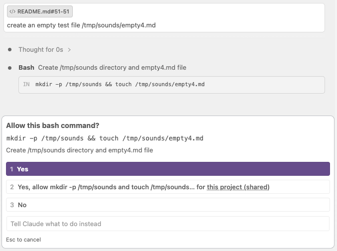
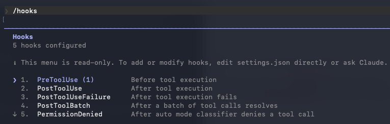

# Never Miss a Claude Code Prompt Again — Add Audio Cues to Your AI Workflow

*Two sounds, zero screen-watching — let your coding agent tell you when it needs you*

I picked this up from [Jure Zakotnik](https://www.linkedin.com/in/jure-zakotnik-0b2a672a4/) while visiting the team at [The RIGHT THING Solutions](https://www.right-thing.solutions/). Jure showed me his setup and I immediately copied it. Sometimes the best productivity tricks come from watching someone else work.



## Requirements

- Claude Code (any recent version with hooks support)
- An audio file for each cue (`.mp3`, `.wav`, `.aiff`) — macOS users can generate them with the built-in `say` command; everyone else can use any sound file they like
- macOS or Windows (playback commands differ; both are covered below)

## The Problem

When you run a long agentic task in Claude Code, you naturally stop watching the screen. You check email, read something, stare out the window. The AI is doing its thing. But at some point it either finishes — or it hits a permission prompt and stops, waiting for you to approve something.

You have no idea. You come back two minutes later and find it frozen at a dialog, or done and sitting idle. Either way, you missed the moment.

The fix is two audio cues that fire automatically:

| Cue | When it fires |
|-----|--------------|
| *"Attention. Choose your destiny."* | Claude needs your input — a permission prompt, a question, a decision |
| *"Flawless victory."* | Claude has finished its work |

No manual action. No watching the screen. The sounds tell you.

## The Solution — Claude Code Hooks

Claude Code has a [hooks system](https://code.claude.com/docs/en/hooks#hook-events) that lets you run any shell command in response to lifecycle events. Four events cover everything:

| Hook | Matcher | When it fires |
|------|---------|---------------|
| `PermissionRequest` | — | Claude needs permission to run a tool (Bash, Edit, Write, …) |
| `PreToolUse` | `AskUserQuestion` | Claude presents an interactive question dialog |
| `Notification` | `idle_prompt` | Claude goes idle waiting for input outside a tool call |
| `Stop` | — | Claude finishes its response turn |

The first three all play the attention sound. `Stop` plays the finished sound. The `idle_prompt` matcher on `Notification` is intentional — without it, `Notification` would also fire for permission prompts and double up with `PermissionRequest`.

The hooks are configured once in `~/.claude/settings.json` (global, so they apply to every project):

```json
"hooks": {
  "PermissionRequest": [
    {
      "hooks": [
        {
          "type": "command",
          "command": "afplay ~/.claude/sounds/attention.aiff",
          "async": true
        }
      ]
    }
  ],
  "PreToolUse": [
    {
      "matcher": "AskUserQuestion",
      "hooks": [
        {
          "type": "command",
          "command": "afplay ~/.claude/sounds/attention.aiff",
          "async": true
        }
      ]
    }
  ],
  "Notification": [
    {
      "matcher": "idle_prompt",
      "hooks": [
        {
          "type": "command",
          "command": "afplay ~/.claude/sounds/attention.aiff",
          "async": true
        }
      ]
    }
  ],
  "Stop": [
    {
      "hooks": [
        {
          "type": "command",
          "command": "afplay ~/.claude/sounds/finished.aiff",
          "async": true
        }
      ]
    }
  ]
}
```

`async: true` runs the sound in the background — it doesn't delay Claude's response.

That's the entire implementation. The rest is just getting the audio files in place.

## Getting Your Audio Files

You need two audio files — one for attention, one for finished. Any format your OS can play works (`.mp3`, `.wav`, `.aiff`).

**macOS — generate them in 10 seconds**

macOS ships with a `say` command and a collection of built-in voices. The Zarvox voice (robotic, unmistakable) works perfectly for this:

```bash
mkdir -p ~/.claude/sounds
say -v Zarvox -r 110 "Attention. Choose your destiny." -o ~/.claude/sounds/attention.aiff
say -v Zarvox -r 110 "Flawless victory." -o ~/.claude/sounds/finished.aiff
```

Want a different voice? Run `say -v '?'` to list all installed voices. Good candidates: `Trinoids` (alien), `Fred` (deep), `Bad News`. Swap the voice name and re-run.

**Windows — or any OS**

Grab any two audio files you like and drop them somewhere accessible. Royalty-free sound effects, a clip from a game, a short voice memo — anything that's distinct and catches your ear. Just update the paths in the hook commands to match where you saved them.

## Wiring Up the Hooks

Open `~/.claude/settings.json` in any editor. This is the global Claude Code settings file — changes here apply to every project.

Add the `hooks` block. If the file already has other settings, merge it in; don't replace the whole file.

**macOS** (uses `afplay`):

```json
"hooks": {
  "PermissionRequest": [
    {
      "hooks": [
        {
          "type": "command",
          "command": "afplay ~/.claude/sounds/attention.aiff",
          "async": true
        }
      ]
    }
  ],
  "PreToolUse": [
    {
      "matcher": "AskUserQuestion",
      "hooks": [
        {
          "type": "command",
          "command": "afplay ~/.claude/sounds/attention.aiff",
          "async": true
        }
      ]
    }
  ],
  "Notification": [
    {
      "matcher": "idle_prompt",
      "hooks": [
        {
          "type": "command",
          "command": "afplay ~/.claude/sounds/attention.aiff",
          "async": true
        }
      ]
    }
  ],
  "Stop": [
    {
      "hooks": [
        {
          "type": "command",
          "command": "afplay ~/.claude/sounds/finished.aiff",
          "async": true
        }
      ]
    }
  ]
}
```

**Windows** (uses PowerShell to play audio):

```json
"hooks": {
  "PermissionRequest": [
    {
      "hooks": [
        {
          "type": "command",
          "command": "powershell -c (New-Object Media.SoundPlayer 'C:\\Users\\you\\sounds\\attention.wav').PlaySync()",
          "async": true
        }
      ]
    }
  ],
  "PreToolUse": [
    {
      "matcher": "AskUserQuestion",
      "hooks": [
        {
          "type": "command",
          "command": "powershell -c (New-Object Media.SoundPlayer 'C:\\Users\\you\\sounds\\attention.wav').PlaySync()",
          "async": true
        }
      ]
    }
  ],
  "Notification": [
    {
      "matcher": "idle_prompt",
      "hooks": [
        {
          "type": "command",
          "command": "powershell -c (New-Object Media.SoundPlayer 'C:\\Users\\you\\sounds\\attention.wav').PlaySync()",
          "async": true
        }
      ]
    }
  ],
  "Stop": [
    {
      "hooks": [
        {
          "type": "command",
          "command": "powershell -c (New-Object Media.SoundPlayer 'C:\\Users\\you\\sounds\\finished.wav').PlaySync()",
          "async": true
        }
      ]
    }
  ]
}
```

Update the file paths to match where you saved your audio files.

To confirm the hooks are loaded, type `/hooks` inside a Claude Code session — it lists every active hook. On my system, there are 5 hooks defined. You can see the list of the hook events and in brackets the number of how many are defined, e.g. (1).

If your hooks aren't firing, Stuart Mason's post [Claude Code hooks not working](https://www.stuartmason.co.uk/posts/claude-code-hooks-not-working) covers the most common causes.



## How It Works in Practice

Once the hooks are in place, the workflow changes without you doing anything differently.

Start a long task — refactoring a package, generating a report, running a multi-step build. Walk away. When something needs you, you'll hear it.

**The attention cue fires in three situations:**

`PermissionRequest` catches tool permission dialogs — the moment Claude Code wants to run a Bash command, edit a file, or call an external tool and needs your approval. This is the most common case in agentic workflows, and it has its own dedicated hook event.

`PreToolUse` with `AskUserQuestion` catches interactive question dialogs — when Claude presents a question and waits for your typed response. These don't trigger `PermissionRequest`.

`Notification` with `idle_prompt` catches the case where Claude goes idle waiting for you outside of a tool call. Without the `idle_prompt` matcher, `Notification` would also fire for permission prompts and double up with `PermissionRequest` — so the matcher keeps each hook's responsibility clean.

**The finished cue fires once:**

`Stop` fires at the end of Claude Code's full response turn — when it's done and control is back with you. One sound, clean signal.

**The result:** two distinct sounds, each unambiguous. You know whether to glance over and approve something quickly, or to sit back down and review the full output.

## Taking It Further

The audio files are just files. The playback commands (`afplay`, PowerShell) are standard OS tools. Nothing about this is Claude Code-specific — any coding agent that supports hooks can use the exact same setup.

The pattern is always the same:
1. Find the hook events your tool exposes for "needs input" and "finished"
2. Point them at the same audio files
3. Use whatever playback command your OS provides

The sounds stay consistent across tools. Once your ears learn what they mean, the cue works regardless of which agent fired it.

As more coding agents add hooks support, this becomes a universal signal layer sitting above all of them — one sound for attention, one for done.

## What This Means for Oracle Teams

- **Zero friction to adopt** — two audio files and a JSON block; no installs, no accounts, no configuration UI
- **Works across tools** — the same files and the same mental model transfer to any agent with hooks support
- **Reclaims focus** — you stop babysitting the screen on long tasks and context-switch properly, knowing the sound will pull you back
- **Immediate feedback loop** — you build an instinct for how long tasks take and when to expect the finished sound
- **Team-friendly tip** — trivially shareable; the whole setup can be explained in a Slack message

## Downloads

- [hooks-config.md](https://github.com/daust/oracleai.substack.com/raw/refs/heads/main/content/004-audio-hooks-coding-agents/assets-download/hooks-config.md) — macOS and Windows hooks config, ready to paste into `~/.claude/settings.json`

---

*Thanks again to [Jure Zakotnik](https://www.linkedin.com/in/jure-zakotnik-0b2a672a4/) and the team at [The RIGHT THING Solutions](https://www.right-thing.solutions/) for this one.*
